# Taobao User Behavior Analysis

## Project Overview
This project analyzes user behavior patterns from a large-scale e-commerce dataset containing over 100 million user interaction records.

The goal is to understand user engagement, product performance, conversion behavior, and potential drop-off points in the shopping journey using SQL and Python.

## Dataset

Source: Alibaba Tianchi User Behavior Dataset

Dataset Link:
https://tianchi.aliyun.com/dataset/dataDetail?dataId=649&userId=1

The dataset contains user interaction records from an e-commerce platform, including:
- User ID
- Item ID
- Category ID
- Behavior type (page view, favorite, cart, purchase)
- Timestamp

The original dataset contains over 100 million interaction records.

Due to file size limitations, raw data is not included in this repository.

## Tools & Technologies
- SQL (MySQL)
- Python
    - pandas
    - numpy
    - matplotlib
- DataGrip
- VS Code

## Project Structure
```text
Taobao-User-Behavior-Analysis/
├── data/                  # Raw and processed datasets (not included)
├── sql/                   # SQL scripts
├── scripts/
│   ├── data_processing/   # Data cleaning & MySQL loading
│   └── analysis/          # User behavior analysis
├── figures/               # Figures by chapter
├── README.md
└── requirements.txt
```

## Project Workflow

The project follows a complete data analysis pipeline:
Raw Data  
→ Data Quality Inspection  
→ Data Cleaning & Transformation  
→ MySQL Database Storage  
→ SQL Aggregation  
→ Python Analysis & Visualization  
→ Business Insights

## Business Questions

This project focuses on the following questions:

1. When are users most active?
2. Which product categories perform best in terms of views, purchases, and conversion?
3. How do user behaviors differ across categories?
4. Are there high-value users?
5. What are the common user behavior paths?
6. Where do users drop off during the shopping journey?

## Analysis & Insights
### 1. User Activity Analysis

This section analyzes user engagement patterns from both temporal and user-level perspectives.

#### Daily Activity Trend

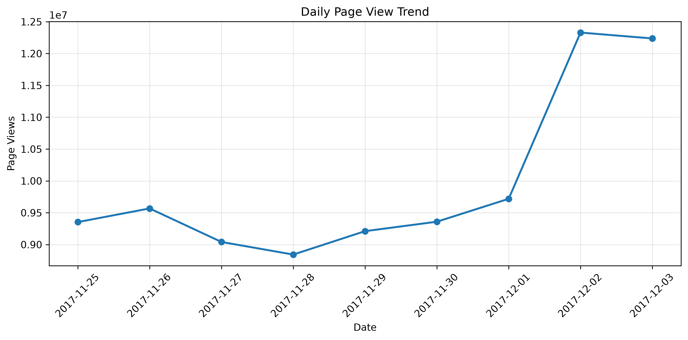


Daily behaviors were calculated from 2017-11-25 to 2017-12-03.

Key findings:

- Page views increased significantly during December 2-3 compared with late November.
- Purchase-related behaviors (buy, cart, and favorite) followed a similar upward trend, suggesting that higher traffic was associated with increased shopping activities.
- However, the magnitude of PV growth was larger than the growth of purchase-related behaviors, indicating that increased browsing activity did not translate proportionally into purchase actions.

#### Hourly Activity Pattern

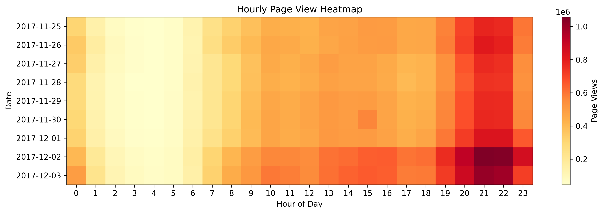

Hourly analysis reveals strong daily usage patterns:

- User activity concentrated between 19:00 and 23:00, indicating evening as the peak browsing period.
- The lowest activity occurred between approximately 2:00 and 5:00 AM.
- The same daily pattern remained consistent even during the traffic increase in early December.

#### User Engagement Analysis

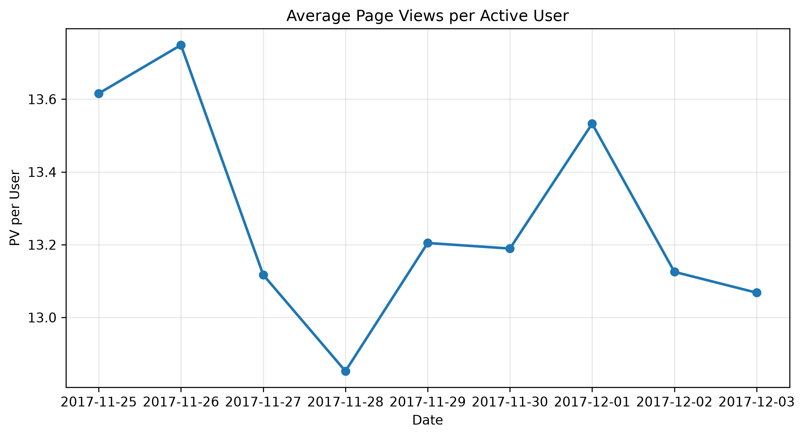

To distinguish whether increased traffic was caused by more users or higher engagement, average PV per active user was calculated.

Key findings:

- The increase in total PV during December was mainly driven by a larger number of active users rather than increased browsing intensity per user.
- Although December had the highest total traffic, individual users showed higher browsing frequency on some late-November days.
- For example, November 26 had the highest average PV per active user, despite having substantially lower total PV than December 2-3.

Overall, the traffic increase was primarily caused by user acquisition rather than deeper engagement from existing users.

### 2. Category Performance Analysis

This section evaluates category performance based on page views (PV), purchases (Buy), and conversion behavior.

#### Category-level Performance

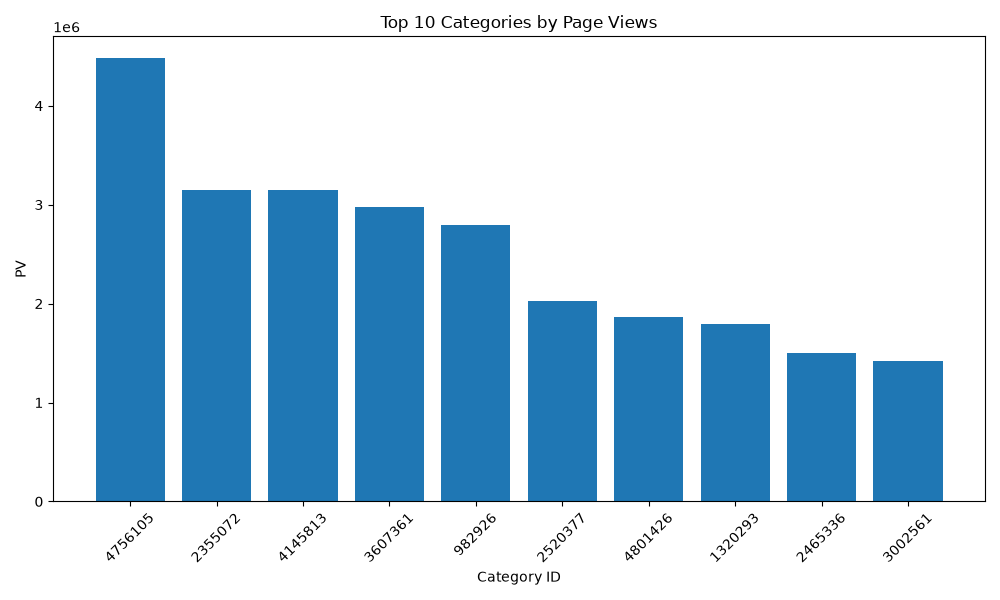

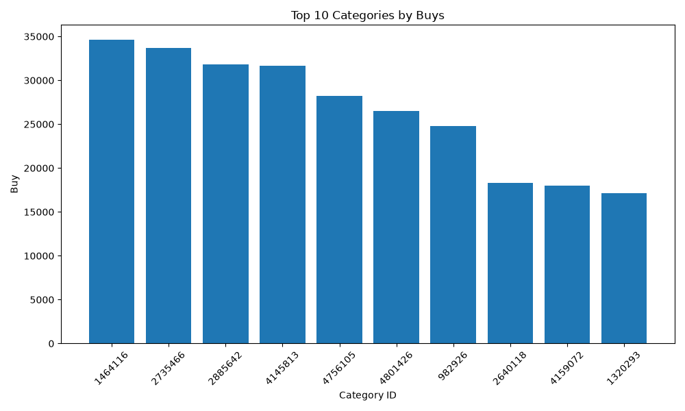

The top-performing categories were identified separately based on page views and purchase volume.

Five categories appeared in both Top 10 PV and Top 10 Buy rankings:

- 4756105
- 4801426
- 982926
- 1320293
- 4145813

These categories were defined as core categories for further item-level analysis.

#### Traffic vs Purchase Behavior

Among the core categories, category 4756105 generated the highest page views.

However, despite its large traffic volume, it ranked only fifth in purchase volume, with a conversion rate of approximately 0.0063.

In contrast, category 1464116 ranked first in purchase volume but did not appear in the Top 10 PV ranking. Its conversion rate reached approximately 0.0506, which was substantially higher than category 4756105.

These results indicate that while page views and purchases are positively associated, traffic volume alone does not fully explain purchase performance. Categories with similar exposure levels may have significantly different conversion efficiency.

#### Item-level Analysis Within Core Categories

Further analysis was conducted on the top items within the five core categories.

The results show that:

- Except for category 4756105, the item with the highest purchase volume was not always the item with the highest page views.
- Within each category, the top-ranked PV item and top-ranked Buy item usually showed substantially higher performance compared with other items.
- This suggests that product exposure and purchase preference are influenced by different factors, and high-traffic products do not always represent the best-selling products.

### 3. Category Behavior Pattern Analysis

This section analyzes whether different categories show different user behavior patterns based on favorite, cart, and purchase behaviors.

#### Behavior Rate Comparison Across Categories

To compare user behavior across categories, three behavior rates were calculated:

- Favorite Rate: fav / pv

- Cart Rate: cart / pv

- Buy Rate: buy / pv

Categories with insufficient activity were removed before calculation to reduce the influence of low-volume categories. The remaining categories were ranked based on buy rate, and the top categories were selected for comparison.

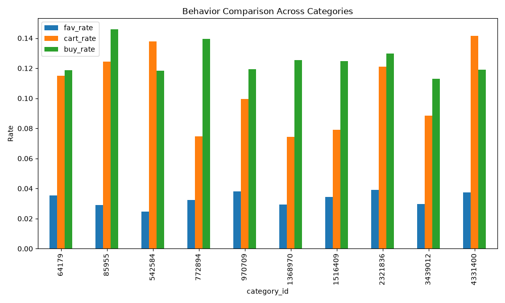

The results show that user behavior patterns vary across categories.

The favorite rate is generally lower than cart rate and buy rate, suggesting that users are less likely to use favorite actions during the shopping process.

Meanwhile, cart rate and buy rate differ significantly among categories. Some categories show stronger carting behavior, while others have higher purchase efficiency, indicating that category characteristics influence user decision patterns.

#### Behavior Composition of Core Categories

Five categories appearing in both the Top 10 PV and Top 10 Buy rankings from the previous analysis were selected as core categories.

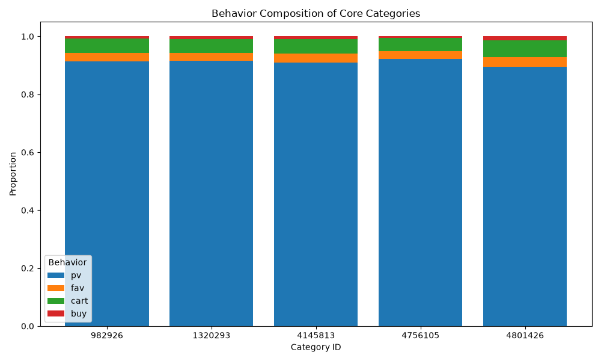

The behavior composition of core categories shows a more consistent pattern compared with general categories.

Across these categories, users are more likely to add products to carts than complete purchases. The overall pattern follows:

cart_rate > fav_rate > buy_rate

### 4. User Value Analysis

This section analyzes user purchase behavior to identify high-value users and understand the distribution of purchase contribution across users.

#### Purchase Frequency Distribution

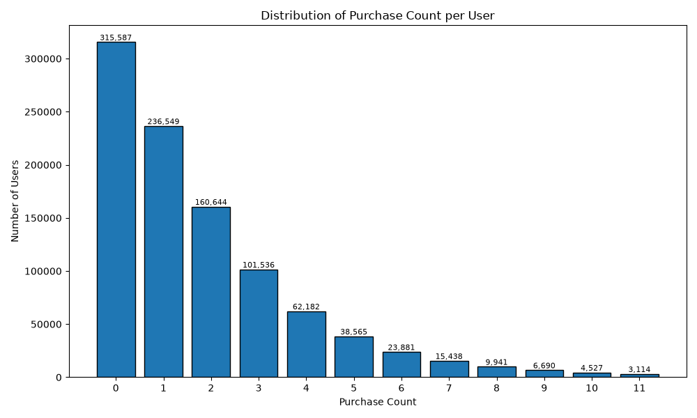

The purchase frequency distribution was first analyzed to understand how many users completed purchases during the observation period.

The analysis shows that only approximately 68.1% of users completed at least one purchase, meaning that more than 30% of users only performed pre-purchase behaviors such as browsing, favoriting, or adding items to cart.

Among purchasing users, most users completed only a small number of purchases, while users with frequent purchases represent a relatively small proportion.

This indicates that user purchase behavior follows a long-tail distribution, with a large number of low-frequency users and a smaller group of highly active buyers.

#### Recency-Frequency Analysis

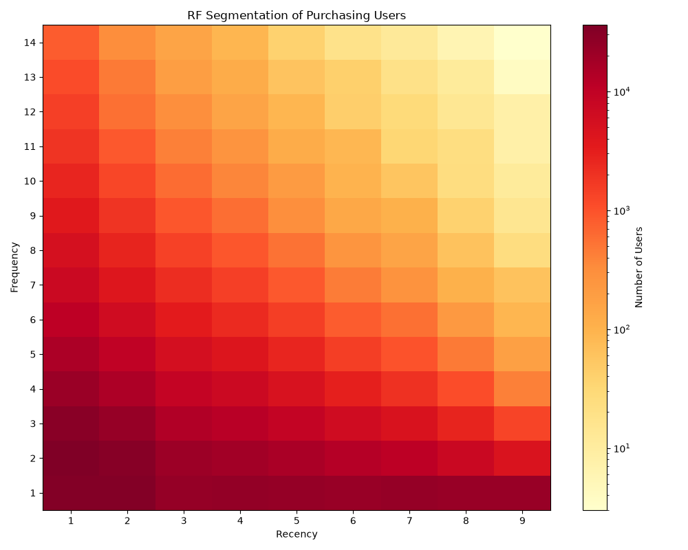

To further understand purchasing user behavior, a Recency-Frequency (RF) analysis was conducted.

The results show that users with shorter recency values generally have higher purchase frequencies, suggesting that recently active users are more likely to make repeated purchases.

However, users with only one purchase appear relatively evenly distributed across different recency values, indicating that recency alone does not distinguish low-frequency buyers.

#### Top Purchasing Users

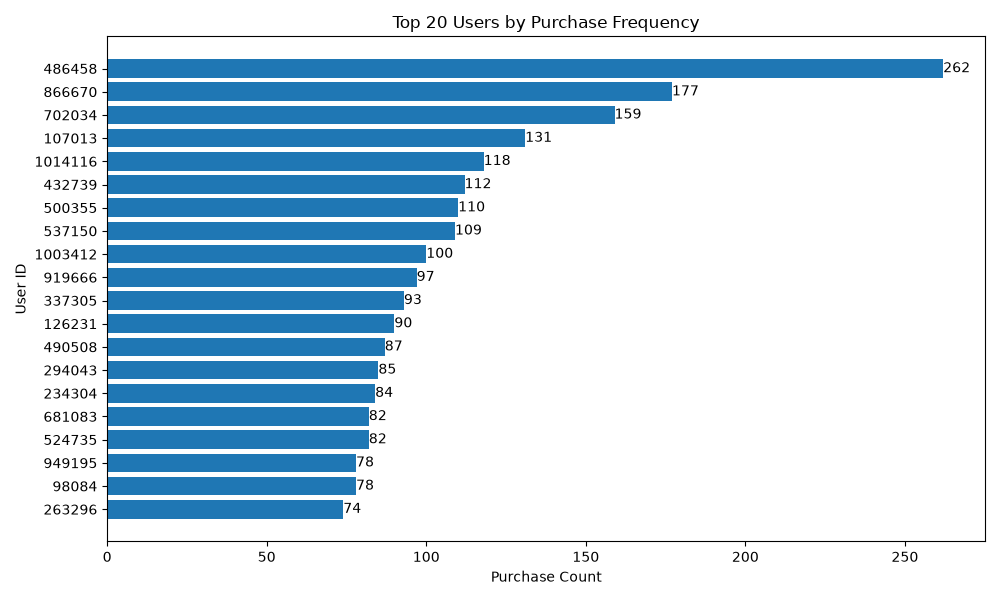

The top 20 users with the highest purchase frequency were identified.

The most active user completed 262 purchases during the observation period, which is significantly higher than the average user.

These high-frequency users represent potential VIP customers and demonstrate the existence of extremely valuable users within the platform.

#### User Segmentation Based on Purchase Frequency

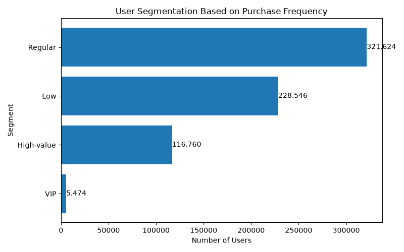

Users were segmented based on purchase frequency thresholds:

- Low: 1 purchase
- Regular: 2–4 purchases
- High-value: 5–14 purchases
- VIP: more than 14 purchases

The thresholds were selected based on purchase frequency distribution, where 4 purchases corresponds approximately to the 75th percentile and 14 purchases corresponds approximately to the 99th percentile.

The segmentation results are:

| Segment | Users | Purchase Share |
|---|---:|---:|
| Low | 228,546 | 11.34% |
| Regular | 871,083 | 43.21% |
| High-value | 803,217 | 39.85% |
| VIP | 112,993 | 5.61% |

Although VIP users represent only a small proportion of users, they contribute a meaningful proportion of purchases.

#### Purchase Contribution Concentration

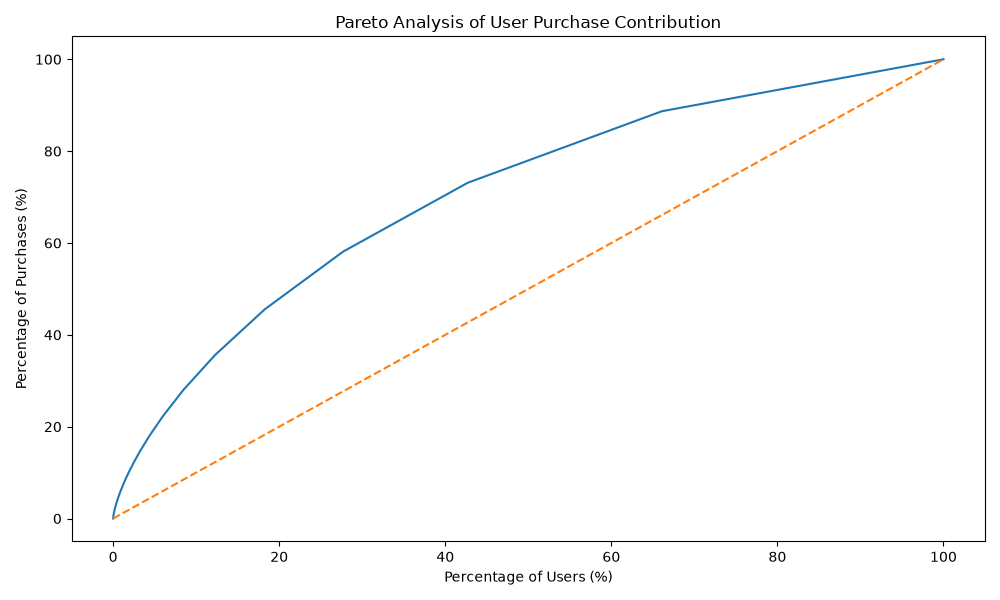

A Pareto analysis was conducted to evaluate how purchase contribution is distributed among users.

The results show an upward-convex contribution curve, indicating that purchases are concentrated among a smaller group of users.

Key findings:

- Top 10% users contribute 31.09% of total purchases.
- Top 20% users contribute 47.88% of total purchases.
- Top 50% users contribute 77.98% of total purchases.

These results confirm the existence of high-value users whose repeated purchases contribute significantly to overall platform transactions.

Identifying and retaining these users can help improve customer lifetime value through targeted recommendation and loyalty strategies.

### 5. User Behavior Path Analysis

This section analyzes user behavior sequences to understand how users move through the shopping journey and where user drop-off occurs.

#### User Coverage Across Shopping Journey

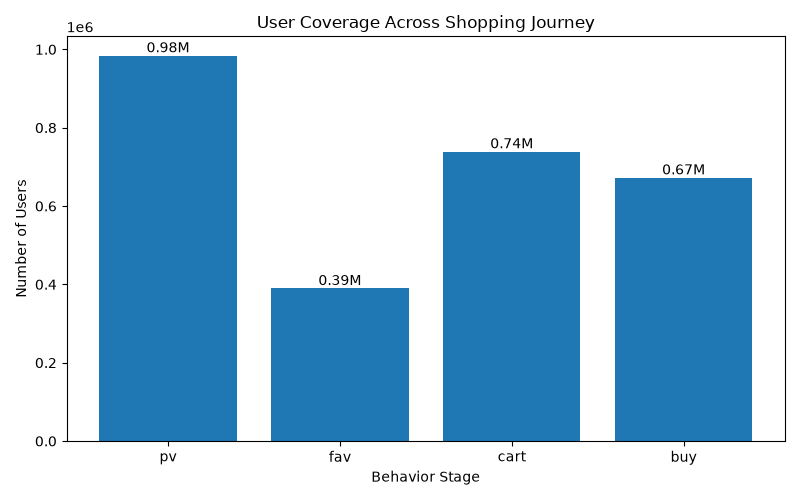

The number of users reaching each stage of the shopping journey was analyzed to identify user drop-off patterns.

The results show that user coverage decreases as users move deeper into the purchase funnel.

Page view (PV) has the largest user coverage, while purchase-related actions have fewer users. Among intermediate behaviors, favoriting has the lowest user participation, suggesting that users are less likely to save products compared with directly adding products to cart.

The decrease in user coverage across stages indicates that user behavior is not a single linear process, and users may leave the shopping journey at different stages.

#### Common User Behavior Paths

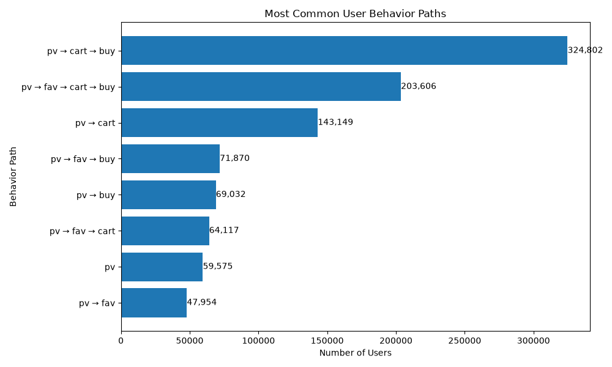

To further understand user behavior sequences, user-level behavior paths were constructed based on the order of actions from the first page view.

The top eight behavior paths were identified:

The most common path is:

- PV → Cart → Buy

with 324,802 users.

The second most common path is:

- PV → Fav → Cart → Buy

with 203,606 users.

These results indicate that adding products to cart is a more common intermediate step before purchase than favoriting products.

However, several frequently observed paths do not eventually lead to purchase, representing users who stopped before completing the purchase process.

Among the top eight behavior paths, only four paths reached the purchase stage, while some users stopped after browsing or intermediate actions.

These findings suggest that although cart activity is strongly associated with purchase completion, a considerable number of users leave the platform before completing transactions.

### 6. User Drop-off Analysis Along Behavior Paths

This section analyzes user retention and drop-off rates across different behavior paths to identify where users are most likely to leave the shopping journey.

#### Retention Analysis Across Different Paths

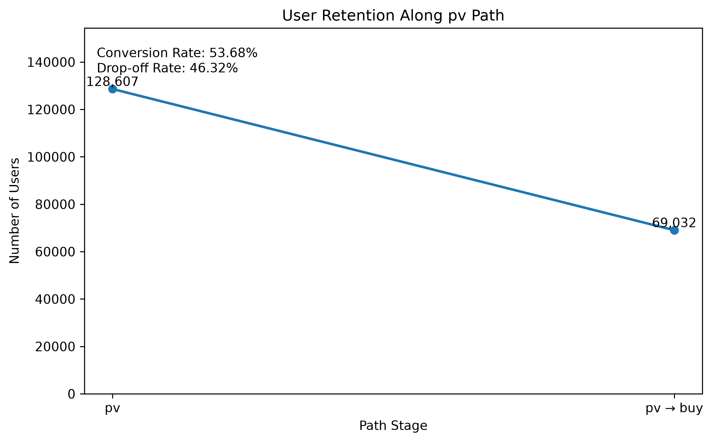

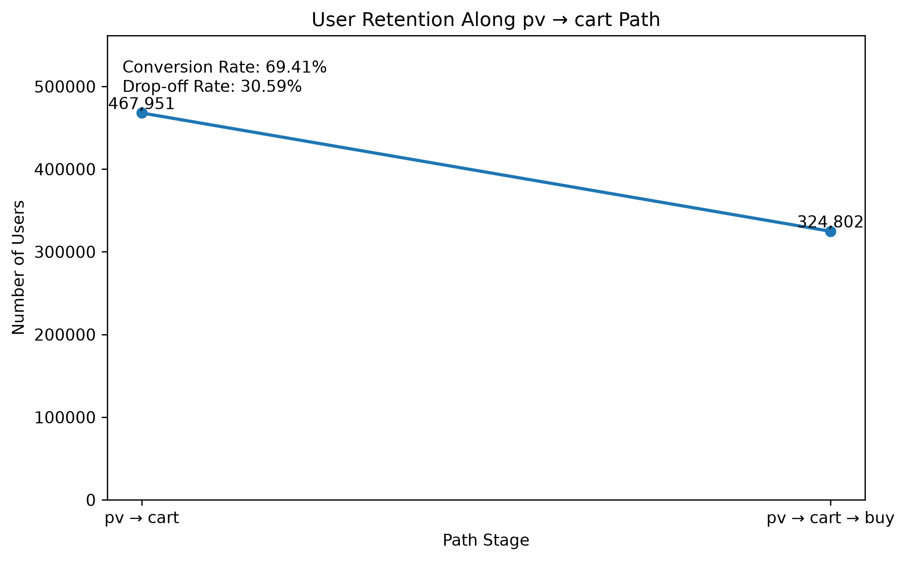

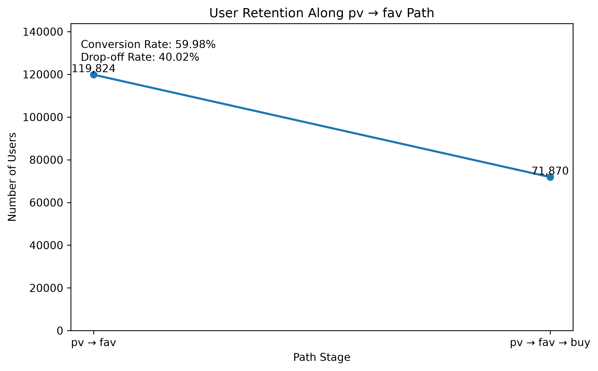

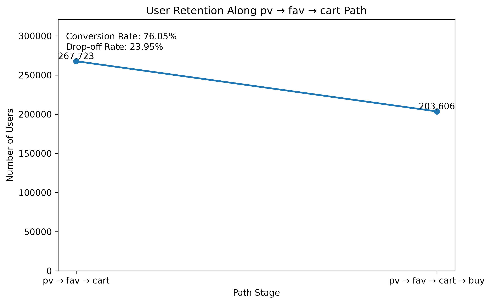

Retention rates were calculated for several major user behavior paths by comparing the number of users reaching the final stage with the number of users entering the path.

The results show that user drop-off exists across all analyzed paths.

Among the selected paths:

- PV → Buy has the highest drop-off rate, with only 53.68% of users completing the purchase.
- PV → Cart → Buy retains 69.41% of users, indicating that adding products to cart is a strong intermediate step before purchase.
- PV → Fav → Buy retains 59.98% of users.
- PV → Fav → Cart → Buy shows the highest retention rate, with 76.05% of users completing the purchase after reaching the cart stage.

These results suggest that users who interact with products more deeply before purchasing are more likely to complete transactions. In particular, users who add products to cart after favoriting show stronger purchase intent compared with users who directly move from browsing to purchase.

However, even the highest-performing path still contains user loss before purchase, indicating potential opportunities for improving conversion at intermediate stages.

## Key Findings

- User activity growth was mainly driven by increasing traffic volume rather than higher individual user engagement.

- High traffic categories do not always generate high purchase volume; conversion efficiency is a critical factor in category performance.

- User behavior patterns differ across categories, while becoming similar as the volume increase, with cart usage generally playing a more important role than favorites in the purchase process.

- A small group of high-value users contributes a large proportion of total purchases.

- Users follow multiple shopping behavior paths, and cart abandonment remains a major conversion challenge.

- Deeper user engagement behaviors, especially favorite-to-cart actions, are associated with higher purchase completion rates.

## Future Improvements

- Incorporate additional product-level information, such as price, inventory, and product characteristics, to better understand factors influencing user purchase decisions.

- Include marketing-related factors, such as advertising campaigns and promotional investment, to evaluate their impact on traffic growth and conversion performance.

- Extend the analysis to a longer observation period to capture seasonal trends, user lifecycle changes, and long-term purchasing patterns.
